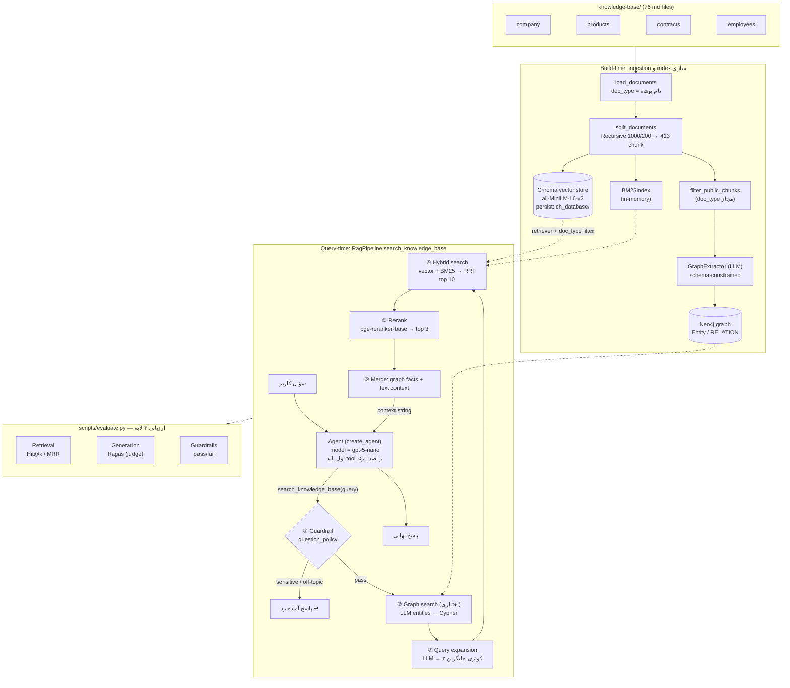

# معماری پروژهٔ Insurellm — Graph + Hybrid RAG

## مدل‌ها
- **LLM اصلی**: `gpt-5-nano` از طریق GAPGPT (OpenAI-compatible) — هم برای پاسخ‌گویی agent، هم query expansion، هم entity extraction، هم graph extraction.
- **Embeddings**: `all-MiniLM-L6-v2` (لوکال، sentence-transformers).
- **Reranker**: `BAAI/bge-reranker-base` (cross-encoder لوکال).
- **Judge ارزیابی**: `JUDGE_MODEL` (پیش‌فرض = همان nano، قابل override).

## دو لایهٔ Guardrail
1. **ورودی** (`question_policy`): قبل از هر retrieval — کوئری sensitive یا off-topic را رد می‌کند.
2. **دسترسی سند** (`doc_type`): هم retriever برداری فیلتر `$in ALLOWED_DOC_TYPES` دارد، هم BM25 فقط روی `public_chunks` ساخته می‌شود.
