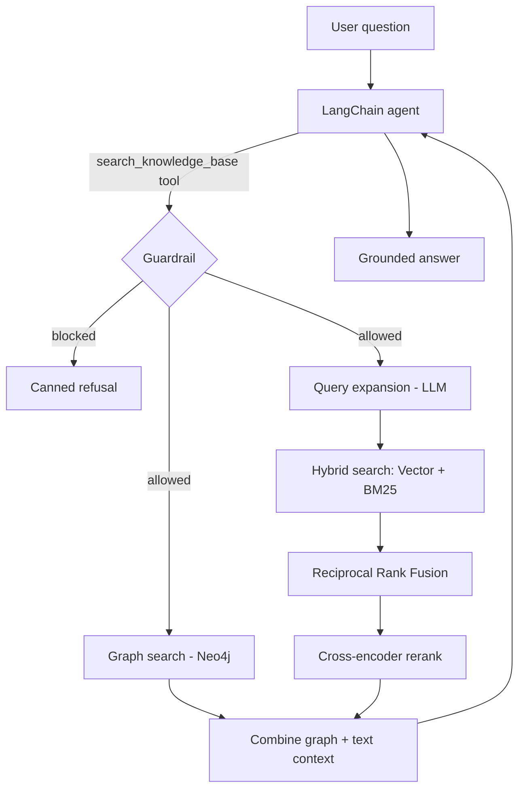

# Insurellm Graph + Hybrid RAG

A retrieval-augmented assistant for the fictional **Insurellm** company. It combines
**hybrid retrieval** (vector + BM25 with Reciprocal Rank Fusion), **cross-encoder reranking**,
a **Neo4j knowledge graph**, and **guardrails**, exposed through a single-tool LangChain agent.

> This is the modular version of the original `test_1.ipynb` notebook (kept for reference in
> [`archive/`](archive/)). The pipeline behavior is unchanged — only the structure is.

---

## فارسی

### معرفی
این پروژه یک دستیار RAG برای شرکت (خیالی) Insurellm است. برای پاسخ به هر سؤال، از ترکیب چند
روش بازیابی استفاده می‌کند:

- **جست‌وجوی برداری** با Chroma + **جست‌وجوی کلیدواژه‌ای** با BM25، و ادغام نتایج با روش
  **Reciprocal Rank Fusion (RRF)**
- **بازچینش (Reranking)** با یک مدل Cross-Encoder
- **گراف دانش** روی Neo4j برای استخراج روابط بین موجودیت‌ها
- **گاردریل** برای رد سؤال‌های خارج از موضوع یا مربوط به اطلاعات شخصی/محرمانه
- یک **ایجنت** LangChain که تنها یک ابزار (`search_knowledge_base`) دارد

### پیش‌نیازها
- Python نسخه 3.12 یا بالاتر
- یک کلید API سازگار با OpenAI (در این پروژه از GapGPT استفاده شده)
- (اختیاری) Docker برای اجرای Neo4j — بخش گراف دانش بدون آن هم به‌صورت «فقط متنی» کار می‌کند

### نصب
اگر از محیط uv در پوشهٔ والد استفاده می‌کنید:

```bash
cd ..
uv sync
```

یا نصب مستقل همین زیرپروژه:

```bash
pip install -r requirements.txt
```

### تنظیم متغیرهای محیطی
یک فایل `.env` (در ریشهٔ workspace، یعنی پوشهٔ والدِ `test_RAG`) با این کلیدها بسازید:

```env
GAPGPT_API_KEY=your_api_key
GAPGPT_BASE_URL=https://api.gapgpt.app/v1
NEO4J_USERNAME=neo4j
NEO4J_PASSWORD=password1234
```

### راه‌اندازی Neo4j (اختیاری)
```bash
docker compose up -d
```
پس از بالا آمدن، محیط Neo4j Browser روی `http://localhost:8474` و آدرس bolt روی
`bolt://localhost:8687` در دسترس است.

### گام‌های اجرا
```bash
# ۱) ساخت یا بارگذاری ایندکس برداری (Chroma)
python scripts/build_vector_store.py

# ۲) ساخت گراف دانش در Neo4j (اختیاری، نیازمند Docker)
python scripts/build_graph.py

# ۳) پرسش از ایجنت
python scripts/ask.py "What products does Insurellm offer?"

# ۴) ارزیابی کیفیت بازیابی (Hit@k و MRR)
python scripts/evaluate.py
```

> نکته: مسیرها نسبت به خودِ پکیج محاسبه می‌شوند، پس اسکریپت‌ها را از هر جایی می‌توانید اجرا کنید.
> کامنت‌های داخل کد همگی انگلیسی هستند.

---

## English

### Overview
The assistant answers questions about Insurellm by fusing several retrieval strategies and
grounding the LLM's answer in the retrieved context. It refuses off-topic questions and
personal/sensitive employee information.

### Architecture



### Project layout
```
test_RAG/
├── rag/                       # the package
│   ├── config.py              # paths, model names, tuning, guardrail terms, prompt
│   ├── llm.py                 # chat model + embeddings factories
│   ├── ingestion.py           # load / split / filter markdown documents
│   ├── vector_store.py        # Chroma build/load + policy-filtered retriever
│   ├── guardrails.py          # question_policy()
│   ├── retrieval/             # bm25, fusion, query_expansion, reranker, hybrid
│   ├── graph/                 # schema, extraction, store (Neo4j), search
│   ├── pipeline.py            # RagPipeline: wires it all + search_knowledge_base()
│   ├── agent.py               # build_agent() + ask()
│   └── evaluation.py          # Hit@k / MRR
├── scripts/                   # build_vector_store, build_graph, ask, evaluate
├── knowledge-base/            # source markdown (company, products, contracts, employees)
├── ch_database/               # persisted Chroma store
├── docker-compose.yml         # Neo4j
├── requirements.txt
└── archive/                   # original notebook + old evaluation script
```

### Requirements
- Python ≥ 3.12
- An OpenAI-compatible chat endpoint (GapGPT here)
- Optional: Docker for Neo4j (the graph degrades gracefully to text-only if unavailable)

Dependencies live in the parent workspace's `../pyproject.toml` (managed with `uv`); a
`requirements.txt` subset is included for standalone installs.

### Environment variables
| Variable | Purpose |
| --- | --- |
| `GAPGPT_API_KEY` | API key for the chat model |
| `GAPGPT_BASE_URL` | Base URL of the OpenAI-compatible endpoint |
| `NEO4J_USERNAME` | Neo4j user (default `neo4j`) — only for the graph |
| `NEO4J_PASSWORD` | Neo4j password (`password1234` in `docker-compose.yml`) |

`.env` is read from the workspace root. The Neo4j bolt URI (`bolt://localhost:8687`) is set in
[`rag/config.py`](rag/config.py).

### Usage
```bash
python scripts/build_vector_store.py        # 1. build/load Chroma (logs chunk counts)
docker compose up -d && python scripts/build_graph.py   # 2. optional: populate Neo4j
python scripts/ask.py "..."                 # 3. ask the agent (add --quiet to hide the trace)
python scripts/evaluate.py                   # 4. retrieval metrics (Hit@k / MRR)
```

Or from Python:
```python
from rag import RagPipeline, build_agent, ask

pipeline = RagPipeline.build()          # enable_graph=False for text-only
agent = build_agent(pipeline)
print(ask(agent, "What are the features of Rellm?"))
```

### How it works
1. **Guardrail** — `question_policy` refuses sensitive terms and off-topic queries up front.
2. **Graph search** — entities are extracted from the query and matched against Neo4j to pull
   related `Source [RELATION] Target` facts (skipped if the graph is disabled/unreachable).
3. **Query expansion** — the LLM generates alternative phrasings to widen recall.
4. **Hybrid search** — each query variant hits both the vector retriever and BM25; the ranked
   lists are fused with RRF.
5. **Reranking** — a cross-encoder rescores the fused candidates and keeps the top few.
6. **Combine** — graph facts and reranked text chunks are merged into the context returned to
   the agent.

### Notes
- Comments are English-only; the original notebook's Persian comments were translated.
- `print` calls became `logging`; run scripts at `INFO` (default) to see the retrieval trace.
- Filesystem paths are resolved relative to the package, so scripts run from any directory.
- The original notebook and the superseded `evaluate_retrieval.py` are preserved in `archive/`.
