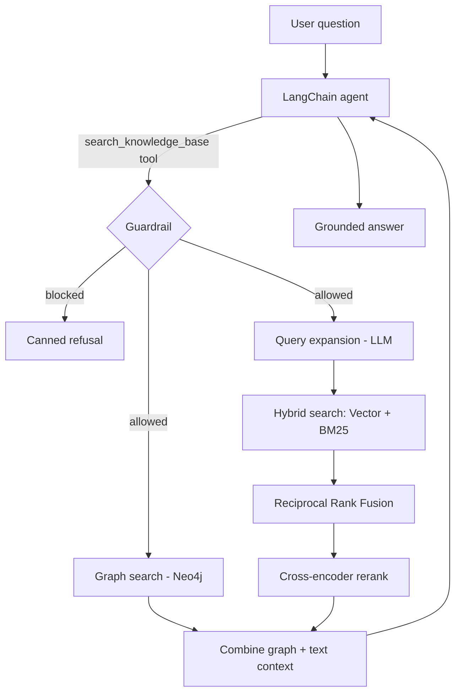

# Insurellm: Graph-Augmented Hybrid RAG & Multi-Agent Architecture

[](https://www.python.org/downloads/)
[](https://github.com/langchain-ai/langchain)
[](https://neo4j.com/)
[](https://www.trychroma.com/)
[](https://smith.langchain.com/)

A modular, production-grade Retrieval-Augmented Generation (RAG) pipeline designed for domain-specific question answering. It integrates **Dense (Vector) + Sparse (BM25)** retrieval with **Reciprocal Rank Fusion (RRF)**, **Cross-Encoder Reranking**, an explicit **Neo4j Knowledge Graph**, enterprise **Guardrails**, and end-to-end **LangSmith Observability**.

---

## 📑 فهرست مطالب / Table of Contents
- [معرفی فارسی (Persian Overview)](#-معرفی-فارسی)
- [Architecture & Key Features](#-architecture--key-features)
- [Project Layout](#-project-layout)
- [Environment Configuration](#-environment-configuration)
- [Quickstart & Usage](#-quickstart--usage)
- [Observability & Tracing (LangSmith)](#-observability--tracing)
- [Evaluation Framework](#-evaluation-framework)

---

## 🇮🇷 معرفی فارسی

این پروژه یک معماری پیشرفته و ماژولار RAG (بازیابی ارتقایافته با تولید) برای سازمان فرضی **Insurellm** است. هدف اصلی این سیستم، حذف توهم مدل‌های زبانی (Hallucination) و پاسخ‌دهی متکی به شواهد از طریق ترکیب بازیابی ساختاریافته و معنایی است.

### ویژگی‌های اصلی:
1. **بازیابی ترکیبی (Hybrid Search):** ترکیب جست‌وجوی معنایی/برداری (Chroma DB) و تطبیق کلمات کلیدی (BM25) به همراه فیوژن نتایج توسط الگوریتم **Reciprocal Rank Fusion (RRF)**.
2. **گسترش پرامپت (Query Expansion):** تولید کوئری‌های جایگزین توسط LLM برای افزایش پوشش بازخوانی (Recall).
3. **بازچینش (Cross-Encoder Reranking):** مرتب‌سازی مجدد دقیق‌ترین چانک‌ها به کمک مدل Cross-Encoder برای بهینه‌سازی دقیق کانتکست ارسالی.
4. **گراف دانش (Knowledge Graph):** اتصال به Neo4j جهت استخراج و تزریق روابط موجودیتی صریح (Entities & Relationships).
5. **گاردریل (Enterprise Guardrails):** فیلتر خودکار و مهار پرسش‌های خارج از دامنه‌، محرمانه یا نامرتبط پیش از مرحله بازیابی.
6. **رصدپذیری کامل (End-to-End Observability):** پایش گام‌به‌گام و محاسبه تأخیر (Latency) هر مرحله با **LangSmith**.

---

## 🏛 Architecture & Retrieval Flow

```text
User Query
    │
    ▼
[ Guardrail Policy Check ] ──(Violation)──► Return Safe Refusal
    │ (Allowed)
    ├─────────────────────────────────┐
    ▼                                 ▼
[ Knowledge Graph (Neo4j) ]   [ Query Expansion (LLM) ]
(Extract entities & facts)            │
    │                         ┌───────┴────────┐
    │                         ▼                ▼
    │                 [ Vector Store ]    [ BM25 Index ]
    │                 (Dense Embeddings)  (Sparse Tokens)
    │                         └───────┬────────┘
    │                                 ▼
    │                     [ Reciprocal Rank Fusion ]
    │                                 ▼
    │                     [ Cross-Encoder Reranker ]
    │                                 ▼
    └───────────────┬─────────────────┘
                    ▼
     [ Merged Structured Context ]
                    │
                    ▼
          [ LangChain Agent ] ──► Final Verified Response
### پیش‌نیازها
- Python نسخه 3.12 یا بالاتر
- یک کلید API سازگار با OpenAI (در این پروژه از GapGPT استفاده شده)
- (اختیاری) Docker برای اجرای Neo4j — بخش گراف دانش بدون آن هم به‌صورت «فقط متنی» کار می‌کند

### نصب
اگر از محیط uv در پوشهٔ والد استفاده می‌کنید:

```bash
cd ..
uv sync
```

یا نصب مستقل همین زیرپروژه:

```bash
pip install -r requirements.txt
```

### تنظیم متغیرهای محیطی
یک فایل `.env` (در ریشهٔ workspace، یعنی پوشهٔ والدِ `test_RAG`) با این کلیدها بسازید:

```env
GAPGPT_API_KEY=your_api_key
GAPGPT_BASE_URL=https://api.gapgpt.app/v1
NEO4J_USERNAME=neo4j
NEO4J_PASSWORD=password1234
```

### راه‌اندازی Neo4j (اختیاری)
```bash
docker compose up -d
```
پس از بالا آمدن، محیط Neo4j Browser روی `http://localhost:8474` و آدرس bolt روی
`bolt://localhost:8687` در دسترس است.

### گام‌های اجرا
```bash
# ۱) ساخت یا بارگذاری ایندکس برداری (Chroma)
python scripts/build_vector_store.py

# ۲) ساخت گراف دانش در Neo4j (اختیاری، نیازمند Docker)
python scripts/build_graph.py

# ۳) پرسش از ایجنت
python scripts/ask.py "What products does Insurellm offer?"

# ۴) ارزیابی کیفیت بازیابی (Hit@k و MRR)
python scripts/evaluate.py
```

> نکته: مسیرها نسبت به خودِ پکیج محاسبه می‌شوند، پس اسکریپت‌ها را از هر جایی می‌توانید اجرا کنید.
> کامنت‌های داخل کد همگی انگلیسی هستند.

---

## English

### Overview
The assistant answers questions about Insurellm by fusing several retrieval strategies and
grounding the LLM's answer in the retrieved context. It refuses off-topic questions and
personal/sensitive employee information.

### Architecture



### Project layout
```
test_RAG/
├── rag/                       # the package
│   ├── config.py              # paths, model names, tuning, guardrail terms, prompt
│   ├── llm.py                 # chat model + embeddings factories
│   ├── ingestion.py           # load / split / filter markdown documents
│   ├── vector_store.py        # Chroma build/load + policy-filtered retriever
│   ├── guardrails.py          # question_policy()
│   ├── retrieval/             # bm25, fusion, query_expansion, reranker, hybrid
│   ├── graph/                 # schema, extraction, store (Neo4j), search
│   ├── pipeline.py            # RagPipeline: wires it all + search_knowledge_base()
│   ├── agent.py               # build_agent() + ask()
│   └── evaluation.py          # Hit@k / MRR
├── scripts/                   # build_vector_store, build_graph, ask, evaluate
├── knowledge-base/            # source markdown (company, products, contracts, employees)
├── ch_database/               # persisted Chroma store
├── docker-compose.yml         # Neo4j
├── requirements.txt
└── archive/                   # original notebook + old evaluation script
```

### Requirements
- Python ≥ 3.12
- An OpenAI-compatible chat endpoint (GapGPT here)
- Optional: Docker for Neo4j (the graph degrades gracefully to text-only if unavailable)

Dependencies live in the parent workspace's `../pyproject.toml` (managed with `uv`); a
`requirements.txt` subset is included for standalone installs.

### Environment variables
| Variable | Purpose |
| --- | --- |
| `GAPGPT_API_KEY` | API key for the chat model |
| `GAPGPT_BASE_URL` | Base URL of the OpenAI-compatible endpoint |
| `NEO4J_USERNAME` | Neo4j user (default `neo4j`) — only for the graph |
| `NEO4J_PASSWORD` | Neo4j password (`password1234` in `docker-compose.yml`) |

`.env` is read from the workspace root. The Neo4j bolt URI (`bolt://localhost:8687`) is set in
[`rag/config.py`](rag/config.py).

### Usage
```bash
python scripts/build_vector_store.py        # 1. build/load Chroma (logs chunk counts)
docker compose up -d && python scripts/build_graph.py   # 2. optional: populate Neo4j
python scripts/ask.py "..."                 # 3. ask the agent (add --quiet to hide the trace)
python scripts/evaluate.py                   # 4. retrieval metrics (Hit@k / MRR)
```

Or from Python:
```python
from rag import RagPipeline, build_agent, ask

pipeline = RagPipeline.build()          # enable_graph=False for text-only
agent = build_agent(pipeline)
print(ask(agent, "What are the features of Rellm?"))
```
📊 Evaluation FrameworkThe pipeline supports both retrieval-focused and end-to-end generational metrics:Bashpython scripts/evaluate.py
Retrieval Benchmarks: Evaluates ranking effectiveness using standard Information Retrieval (IR) metrics:Hit@k: Verification that ground-truth references exist within top-$k$ returned segments.MRR (Mean Reciprocal Rank): Evaluates how close the most relevant document is placed to the top position.Generational Integrity (Ragas): Supports evaluating Faithfulness (hallucination detection) and Answer Relevance using LLM-as-a-judge patterns.
### How it works
1. **Guardrail** — `question_policy` refuses sensitive terms and off-topic queries up front.
2. **Graph search** — entities are extracted from the query and matched against Neo4j to pull
   related `Source [RELATION] Target` facts (skipped if the graph is disabled/unreachable).
3. **Query expansion** — the LLM generates alternative phrasings to widen recall.
4. **Hybrid search** — each query variant hits both the vector retriever and BM25; the ranked
   lists are fused with RRF.
5. **Reranking** — a cross-encoder rescores the fused candidates and keeps the top few.
6. **Combine** — graph facts and reranked text chunks are merged into the context returned to
   the agent.


