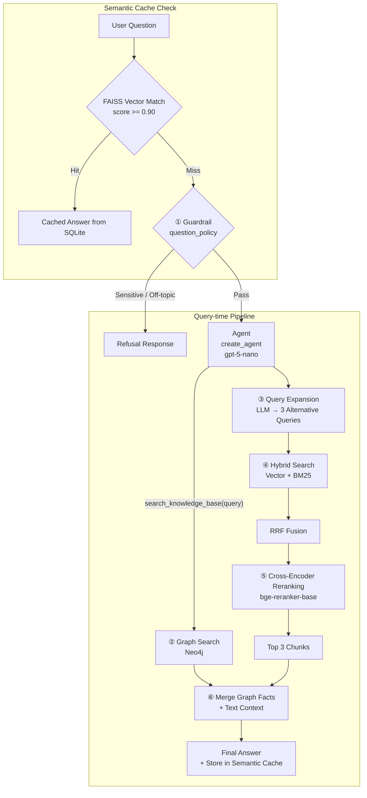

# Advanced RAG, Hybrid Search & Knowledge Graph and Agentic Retrieval Flow

[](https://www.python.org/downloads/)
[](https://github.com/langchain-ai/langchain)
[](https://neo4j.com/)
[](https://www.trychroma.com/)
[](https://smith.langchain.com/)

A modular, production-grade Retrieval-Augmented Generation (RAG) pipeline designed for domain-specific question answering. It integrates **Dense (Vector) + Sparse (BM25)** retrieval with **Reciprocal Rank Fusion (RRF)**, **Cross-Encoder Reranking**, an explicit **Neo4j Knowledge Graph**, enterprise **Guardrails**, **Persistent Semantic Caching**, and end-to-end **LangSmith Observability**.

---

## 📑 فهرست مطالب / Table of Contents
- [معرفی فارسی (Persian Overview)](#-معرفی-فارسی)
- [Architecture & Key Features](#-architecture--key-features)
- [Project Layout](#-project-layout)
- [Environment Configuration](#-environment-configuration)
- [Quickstart & Usage](#-quickstart--usage)
- [Observability & Tracing (LangSmith)](#-observability--tracing)
- [Evaluation Framework](#-evaluation-framework)

---

## 🇮🇷 معرفی فارسی

این پروژه یک معماری پیشرفته و ماژولار RAG (بازیابی ارتقایافته با تولید) برای سازمان فرضی **Insurellm** است. هدف اصلی این سیستم، حذف توهم مدل‌های زبانی (Hallucination) و پاسخ‌دهی متکی به شواهد از طریق ترکیب بازیابی ساختاریافته، معنایی و حافظه کش معنایی پایدار است.

### ویژگی‌های کلیدی:
1. **کش معنایی پایدار (Persistent Semantic Cache):** استفاده از FAISS و SQLite برای ذخیره و بازیابی پاسخ پرسش‌های مشابه با آستانه شباهت بالا، جهت کاهش چشمگیر تأخیر و هزینه‌های API.
2. **بازیابی ترکیبی (Hybrid Search):** ترکیب جست‌وجوی معنایی/برداری (Chroma DB) و تطبیق کلمات کلیدی (BM25) به همراه فیوژن نتایج توسط الگوریتم **Reciprocal Rank Fusion (RRF)**.
3. **گسترش پرامپت (Query Expansion):** تولید کوئری‌های جایگزین توسط LLM برای افزایش پوشش بازخوانی (Recall).
4. **بازچینش (Cross-Encoder Reranking):** مرتب‌سازی مجدد دقیق‌ترین چانک‌ها به کمک مدل Cross-Encoder (`bge-reranker-base`) برای بهینه‌سازی دقیق کانتکست ارسالی.
5. **گراف دانش (Knowledge Graph):** اتصال به Neo4j جهت استخراج و تزریق روابط موجودیتی صریح (Entities & Relationships).
6. **گاردریل (Enterprise Guardrails):** فیلتر خودکار و مهار پرسش‌های خارج از دامنه‌، محرمانه یا نامرتبط پیش از مرحله بازیابی.
7. **رصدپذیری کامل (End-to-End Observability):** پایش گام‌به‌گام و محاسبه تأخیر (Latency) هر مرحله با **LangSmith**.

---

## 🏛 Architecture & Retrieval Flow



### Retrieval Flow

1. **Semantic Cache Check**
   ابتدا سؤال کاربر با cache معنایی مقایسه می‌شود. اگر similarity score از `0.90` بیشتر باشد، پاسخ ذخیره‌شده از SQLite برگردانده می‌شود و pipeline اصلی اجرا نمی‌شود.

2. **Guardrail**
   در صورت عدم وجود cache hit، سؤال ابتدا توسط `question_policy` بررسی می‌شود تا پرسش‌های خارج از حوزه یا حساس قبل از retrieval کنترل شوند.

3. **Agentic Retrieval**
   در صورت عبور از guardrail، Agent با استفاده از ابزار `search_knowledge_base` فرآیند بازیابی را مدیریت می‌کند.

4. **Knowledge Graph Search**
   در مسیر Graph، موجودیت‌های موردنیاز از سؤال استخراج شده و برای جست‌وجوی روابط مرتبط در **Neo4j** استفاده می‌شوند.

5. **Query Expansion**
   هم‌زمان، LLM چند query جایگزین تولید می‌کند تا احتمال پیدا کردن اطلاعات مرتبط افزایش پیدا کند.

6. **Hybrid Search**
   queryهای تولیدشده وارد سیستم Hybrid Retrieval می‌شوند و نتایج **Dense Vector Search** از Chroma با نتایج **Sparse Retrieval** مبتنی بر BM25 ترکیب می‌شوند.

7. **RRF Fusion**
   نتایج دو روش retrieval با استفاده از **Reciprocal Rank Fusion (RRF)** ادغام و یک لیست واحد از candidateها ایجاد می‌شود.

8. **Cross-Encoder Reranking**
   candidateهای بازیابی‌شده با `bge-reranker-base` مجدداً رتبه‌بندی می‌شوند تا مرتبط‌ترین chunkها برای مرحله generation انتخاب شوند.

9. **Context Assembly**
   در نهایت، facts استخراج‌شده از Knowledge Graph با context متنی حاصل از retrieval ترکیب می‌شوند.

10. **Generation & Caching**
    مدل بر اساس context نهایی پاسخ را تولید می‌کند و نتیجه برای استفاده در درخواست‌های مشابه در semantic cache ذخیره می‌شود.


## 📂 Project Layout

```text
test_RAG/
│
├── rag/                              # Core RAG package
│   ├── config.py                     # Configuration & constants
│   ├── llm.py                        # Chat & embedding model factories
│   ├── cache.py                      # Persistent semantic cache
│   ├── ingestion.py                  # Document loading & chunking
│   ├── vector_store.py               # Chroma vector store & retriever
│   ├── guardrails.py                 # Input policies & guardrails
│   │
│   ├── retrieval/                    # Retrieval components
│   │   ├── bm25.py                   # Sparse retrieval
│   │   ├── fusion.py                 # RRF fusion
│   │   ├── query_expansion.py        # Query expansion
│   │   └── hybrid.py                 # Hybrid retrieval
│   │
│   ├── graph/                        # Knowledge Graph components
│   │   ├── schema.py                 # Graph schema
│   │   ├── extraction.py             # Entity & relationship extraction
│   │   └── search.py                 # Neo4j graph search
│   │
│   ├── pipeline.py                   # End-to-end RAG pipeline
│   └── agent.py                      # LangChain agent & tools
│
├── scripts/                          # CLI & evaluation scripts
│   ├── build_vector_store.py         # Build Chroma index
│   ├── build_graph.py                # Build Neo4j graph
│   ├── ask.py                        # Query the agent
│   └── evaluate.py                   # Run evaluation
│
├── knowledge-base/                   # Insurellm knowledge base
│   ├── projects/
│   ├── contracts/
│   ├── company/
│   └── employees/
│
├── cache_store/                      # Persistent cache storage
├── ch_database/                      # Chroma vector database
├── docker-compose.yml                # Neo4j configuration
└── requirements.txt                  # Python dependencies
```

## 🚀 Quickstart & Usage

## 🚀 Quickstart & Usage

### پیش‌نیازها

* Python نسخه `3.12+`
* یک API Key سازگار با OpenAI؛ در این پروژه از GapGPT استفاده شده است.
* Docker برای اجرای Neo4j — اختیاری

### نصب و راه‌اندازی

کلون کردن repository و نصب وابستگی‌ها:

```bash
pip install -r requirements.txt
```

متغیرهای محیطی را در فایل `.env` تنظیم کنید:

```env
GAPGPT_API_KEY=your_api_key
GAPGPT_BASE_URL=https://api.gapgpt.app/v1

NEO4J_USERNAME=neo4j
NEO4J_PASSWORD=password1234
```

### راه‌اندازی Neo4j

در صورت استفاده از Knowledge Graph:

```bash
docker compose up -d
```

### اجرای Pipeline

ساخت Vector Store:

```bash
python scripts/build_vector_store.py
```

ساخت Knowledge Graph:

```bash
python scripts/build_graph.py
```

پرسش از Agent:

```bash
python scripts/ask.py "What products does Insurellm offer?"
```

اجرای Evaluation:

```bash
python scripts/evaluate.py
```

گاردریل (Guardrails): تست‌های رگرسیون deterministic برای بررسی عملکرد صحیح در رد پرسش‌هامرتبط یا محرمانه.
